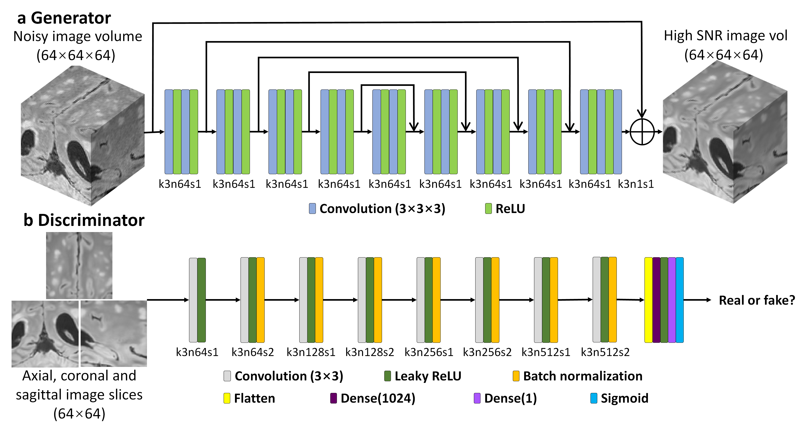

# High-fidelity volumetric brain MRI using a hybrid generative adversarial network (HDnGAN)
Keras implementation for HDnGAN

## 1. Network architecture

**Figure 1. HDnGAN architecture.** HDnGAN consists of a 3D generator (a) and a 2D discriminator (b). The 3D generator is modified from 3D U-Net by removing all max-pooling, up-sampling and batch normalization layers and keeping the number of kernels constant (n = 64) across all layers (denoted as MU-Net). The input of the generator is a noisy image volume (64×64×64 voxels). The output of the generator is a synthesized image volume with high signal-to-noise ratio (SNR). The 2D discriminator adopts the discriminator of SRGAN, with spectral normalization incorporated in each layer to stabilize training. The input of the discriminator is an axial, coronal, or sagittal image slice (64×64 pixels) from the image volume synthesized by the generator or the ground-truth high-SNR image volume. The output of the discriminator is a probability value of the input image slice being classified as a real high-SNR image slice. The abbreviation k3n64s1 stands for a kernel size equal to 3×3 for the generator or 3×3×3 for the discriminator, a kernel number equal to 64 and stride equal to 1, and so on.

## 2. HDnGAN denoising efficacy

Due to its novel hybrid architecture, HDnGAN can achieve high-fidelity denoising using limited numbers of training subjects. The following results were from network trained from ~25 subjects. This study was approved by the Mass General Brigham institutional review board and was HIPAA compliant. With written informed consent, data were acquired in 33 patients (20 for training, 5 for validation, 8 for evaluation) undergoing clinical evaluation for demyelinating disease at the Massachusetts General Hospital as part of a separate clinical validation study of Wave-CAIPI FLAIR compared to standard 3D T2-SPACE FLAIR. All patients were scanned on a whole-body 3-Tesla MAGNETOM Prisma MRI scanner (Siemens Healthcare) equipped with a 20-channel head coil.

**Figure 2. Effects of the adversarial loss on image quality.** Representative axial image slices (rows a and c) and enlarged views of the left basal ganglia and left thalamus (rows b and d) from different methods and weights (λ) of the adversarial loss in a multiple sclerosis patient for evaluation. For λ = 0 (rows a, b, column iii), the training only minimizes the content loss (i.e., voxel-wise mean squared error). In this case, the HDnGAN is effectively the generator (i.e., MU-Net). For λ = ∞, the training only minimizes the adversarial loss (rows c, d, column vi). Image similarity metrics including the mean squared error (MSE) and VGG perceptual loss (VGG) are listed to quantify the similarity between images from different methods and the standard FLAIR image.

**Figure 3. Visual comparison of results from different methods.** Representative sagittal image slices (row a and c) and enlarged regions (row b and d) from standard FLAIR data (row a, b, column i), Wave-CAIPI data (row a, b, column ii), AONLM-denoised results (row a, b, column iii), BM4D-denoised results (row a, b, column iv), MU-Net results (row c, d, column ii), 3D GAN (λ = 10-3) results (row c, d, column iii) and HDnGAN (λ = 10-3) results (row c, d, column iv) from one evaluation subject. Image similarity metrics including the mean squared error (MSE) and VGG perceptual loss (VGG) are listed to quantify the similarity between images from different methods and the standard FLAIR image.

## 3. Tutorial

*To run the whole pipeline, simply run **HDnGAN_tutorial.ipynb** in Google Colab.*

Version of Python: 3.7.9.

Version of main packages:

keras                     2.3.1; 

numpy                  1.19.2; 

tensorflow-gpu    2.1.0.

- *cnn_models.py* contains 3 CNN models: a 3D generator (3D Modified U-Net (MU-Net)), a 2D discriminator, and the hybrid GAN model.
- *cnn_utils.py* contains customized loss functions and other useful functions (mainly for image pre-processing).
- *SpectralNormalizationKeras.py* is the keras implementation of spectral normalization from https://github.com/IShengFang/SpectralNormalizationKeras.
- *s_HDnGAN_trainCNN.py* contains the whole pipeline of training and applying the network.
- *example_hcp_data* contains the T1w data from 3 healthy subjects from  WU-Minn-Oxford Human Connectome Project (HCP) (open access data use term at https://www.humanconnectome.org/study/hcp-young-adult/document/wu-minn-hcp-consortium-open-access-data-use-terms). For the purpose of demonstration, we trained HDnGAN with 2 of them for 20 epoch (adversarial loss weight: 1e-3) and validated & evaluated the network with the rest one (mwu100307). The output image after applying the network for the test subject can be found at *"/example_hcp_data/mwu100307/pred/HDnGAN_lw1e-3_pred.nii.gz"*. Although the numbers of training subjects are extremely limited, the network still produced image with realistic textures and acceptable image quality. The corresponding weights for the generator can be found in *generator* folder, while the training and validation loss can be found in *loss* folder.

## 4. Reference

[1]  Li, Z., Tian, Q., Ngamsombat, C., Cartmell, S., Conklin, J., Gonçalves Filho, A. L. M., ... & Huang, S. Y. (2021). High-fidelity fast volumetric brain MRI using synergistic wave-controlled aliasing in parallel imaging and a hybrid denoising generative adversarial network. *bioRxiv*: https://www.biorxiv.org/content/10.1101/2021.01.07.425779v2.abstract. (Submitted to *Medical Physics*).

 [2] Li, Z. Oral Presentation. The 2021 Annual Scientific Meeting of ISMRM. Video link: https://cds.ismrm.org/protected/21MPresentations/videos//0390.htm. (Magna Cum Laude Merit Award).

